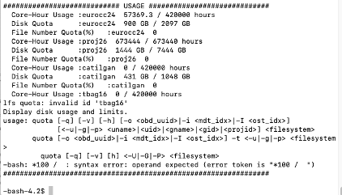

**MD simulations**

In the MIDSTlab we primarily use VMD/NAMD suite of programs to carry out MD simulations, trajectory visualization and basic analyses. Therefore, you are expected to follow and complete VMD & NAMD tutorials at http://www.ks.uiuc.edu/Training/Tutorials/ ( ‘using VMD’ and ‘NAMD tutorial’ are sufficient for beginners; however, please do not skip any steps; they come back to haunt you. Also, the theoretical information given in boxes is absolutely necessary).

To make sure you have a smooth environment for running on your own computer, follow the instructions [here](https://github.com/midstlab/Welcome_pack_for_MIDSTLab/blob/main/HowTo_VMD_NAMD.pdf)  

**Molecular graphics**

MIDSTlab primarily uses VMD and ChimeraX for visualizing the molecules of interest. You have already learned about VMD in the previous step. For ChimeraX, do this [tutorial](https://github.com/midstlab/Welcome_pack_for_MIDSTLab/blob/main/ChimeraX_handson.pdf)


**How to run an MD simulation on TRUBA and ToSUn servers?**

For starters, familiarize yourself with basic unix commands. Here is a nice starter kit: [https://www.math.utah.edu/lab/unix/unix-commands.html]

**How to get access to servers?**

Lab computers: all computers have the same username/password; please contact any current member of the lab for initial instructions on how to use them and allocations.

ToSUn: request from your mentor to e-mail Serdar Acır (serdar.acir@sabanciuniv.edu).

TRUBA: with your mentor cc'd, e-mail to grid-teknik@ulakbim.gov.tr


**Connection to TRUBA :** If you are working off-campus, you should
install OpenVPN first. Go to:
[[https://docs.truba.gov.tr/TRUBA/kullanici-el-kitabi/open-vpn/index.html]](https://docs.truba.gov.tr/TRUBA/kullanici-el-kitabi/open-vpn/index.html)

Connect to TRUBA main server by typing ```ssh username@172.16.7.1``` in
the terminal. After entering your password, type ```ssh barbun1``` to
connect to the barbun interface. Here you can see the disk quotas and
computation times allocated to your account as shown below:



You can also find detailed information about connection with SSH here:
[[https://docs.truba.gov.tr/TRUBA/kullanici-el-kitabi/kullanici-ara-yuzu/ssh-ile-baglanti/index.html]](https://docs.truba.gov.tr/TRUBA/kullanici-el-kitabi/kullanici-ara-yuzu/ssh-ile-baglanti/index.html)

**Connection to ToSUn:** For working off-campus :
[[https://mysu.sabanciuniv.edu/it/en/windows-openvpn-network-configuration]](https://mysu.sabanciuniv.edu/it/en/windows-openvpn-network-configuration)

Connect to ToSUn server by typing 
```ssh username@10.3.5.102``` in the
terminal. Enter your password.

**How to manage file transfer between the local computer and TosUN/TRUBA
servers?**

For file transfer using SFTP (SSH file transfer), download Cyberduck
(for Mac) or MobaXterm or WinSCP (Windows). Once you are connected, drag
and drop the necessary input files for your simulation in the same
folder (for example; ionized.pdb, ionized.psf, ionized.conf., toppar
folder and sample.sh or sample.slurm files). As the run progresses, the
output files will be deposited in the same directory.

Send your job to ToSUn : ```sbatch sample.sh```

Send your job to Truba: ```sbatch sample.slurm```

-   Excellent step-by-step tutorial to familirize yourself with Unix Shell :
    [https://swcarpentry.github.io/shell-novice/]

-   For basic slurm commands:
    [[https://docs.truba.gov.tr/TRUBA/kullanici-el-kitabi/kaynakyoneticisi-isdongusu/basic_slurm_commands.html]](https://docs.truba.gov.tr/TRUBA/kullanici-el-kitabi/kaynakyoneticisi-isdongusu/basic_slurm_commands.html)

-   For batch run preparation:
    [[https://github.com/midstlab/md_simulation_run]](https://github.com/midstlab/md_simulation_run)
   

-   For detailed info for GPU/CPU usage @ ToSUn:
    [[https://hpc.sabanciuniv.edu/]](https://hpc.sabanciuniv.edu/)

-   For sample submission files
    :https://github.com/midstlab/server_job_submission
